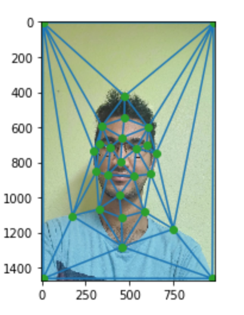
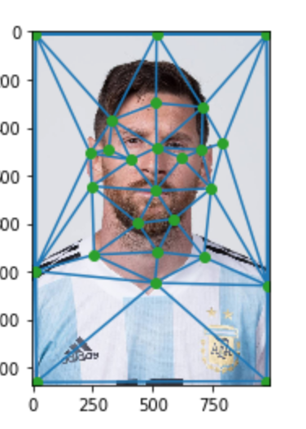
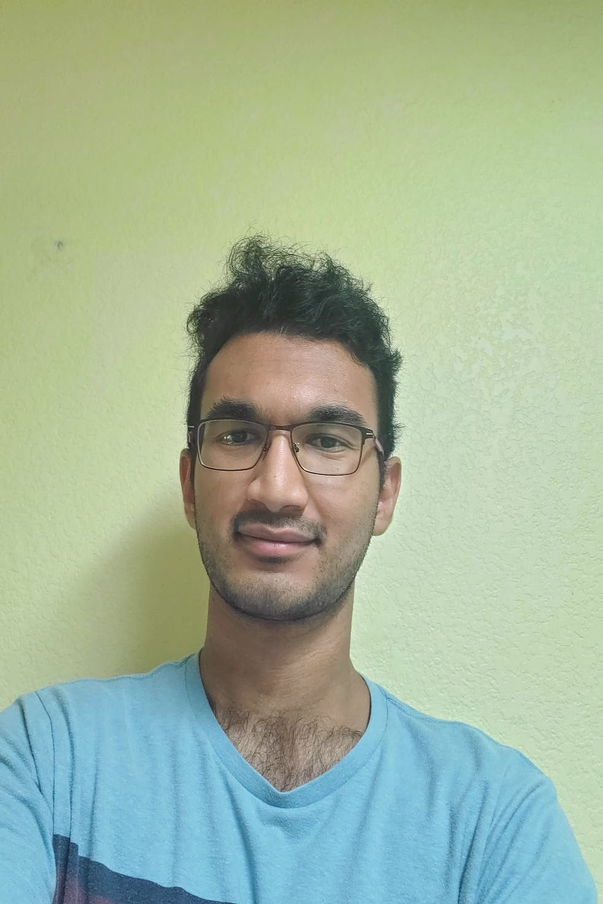
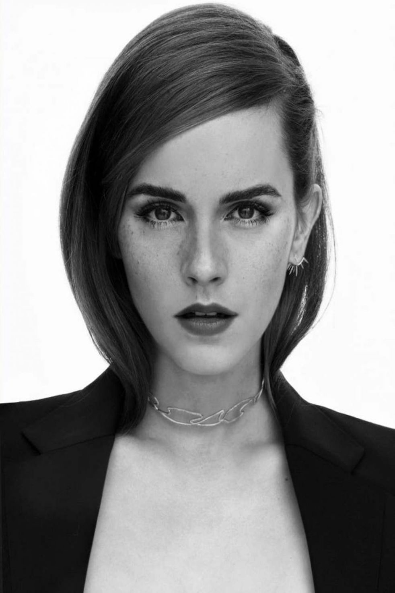

# Project 3: Face Morphing

## Defining Correspondences

I defined 27 points of comparison between my face and Messi's face. The diagrams with the triangles are below:

## Computing the 'Mid-Way' Face

Here is the mid-way face after computing the average shape, warping both faces into that shape and averaging the colors together.

## Morph Sequence

## Mean Face of population

I computed the average shape of the population but unfortunately the average face was showing up as a black image. Please look at my code for a more detailed explanation.

## Bells and Whistles

### Change gender and age

I used a picture of Emma Watson and changed my face shape into an average of her face shape and mine.

Since she has very high, prominent cheekbones, the image is very distorted around my cheekbones.

### Morph video of some of my FB profile pics over the years
I used 2 of my past profile pics and created a morphing video of how they have evolved over the years! I had an obsession with V for Vendetta and the Joker in high school and it shows

